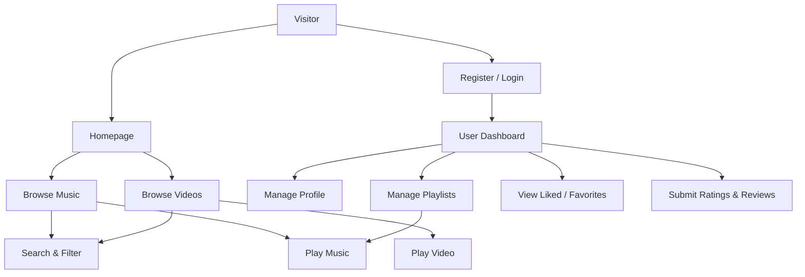
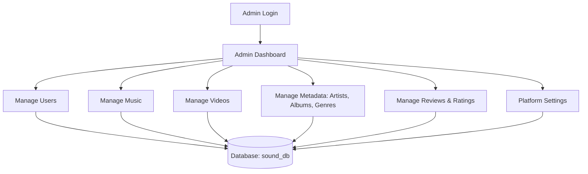

# SOUND

## Project Overview

SOUND is a web-based music and video streaming platform that allows users to discover, play, and organize media content. Built with PHP and MySQL, the application features separate interfaces for public visitors, registered users, and administrators. It supports media filtering, custom playlists, and user engagement through ratings and reviews.

## Project Purpose

The purpose of the application is to provide a unified platform for streaming audio and video content. It offers administrators comprehensive control over media management and provides users with a personalized experience to curate their own music libraries through playlists and favorites.

## Main Features

- Public media browsing and playback (Music and Videos).
- Advanced filtering functionality based on artists, genres, languages, and release years.
- User authentication and role-based access control (Admin vs. User).
- Personalized user dashboards with playlist management and favorites tracking.
- Interactive media elements including user ratings and text-based reviews.
- Comprehensive administrative panel for managing all aspects of the platform's content.

## User Features

- **Media Playback:** Play music tracks and video content directly in the browser via custom player interfaces.
- **Content Discovery:** Browse media collections, apply filters, and search for specific titles.
- **Playlists:** Create custom playlists, mark them as public or private, and seamlessly add or remove tracks.
- **Favorites & Ratings:** Rate music and videos; highly rated items are tracked as favorites/liked content.
- **Reviews:** Submit written reviews for individual music tracks and videos.
- **Profile Management:** Update personal information and upload profile images.

## Admin Features

- **Dashboard Overview:** View high-level platform statistics (total users, music, videos, artists).
- **User Management:** View and manage registered users.
- **Media Management:** Add, edit, and delete music tracks and videos.
- **Metadata Management:** Full CRUD operations for Artists, Albums, Genres, Languages, and Years.
- **Engagement Moderation:** Monitor and manage user ratings and reviews.
- **Site Configuration:** Manage website information and settings.

## Authentication System

- **Registration:** New users can sign up providing basic details. Passwords are securely hashed.
- **Login:** A unified login system (`login.php`) checks the `admins` table first, and falls back to the `users` table.
- **Session Management:** Secure sessions track the active user and their role (`admin` or `user`).
- **Role Handling:** Access control is strictly enforced via helper functions (`requireLogin()`, `requireAdmin()`, `requireUser()`) defined in `includes/auth.php`.
- **Logout:** Safely destroys the session and redirects the user to the homepage.

## Music System

- **Storage:** Music files and cover images are referenced via URLs (supporting both local uploads and external links).
- **Display:** Displayed on the homepage and dedicated music pages.
- **Playback:** Handled dynamically via `play_music.php`, utilizing an integrated web player interface.
- **Organization:** Songs are linked relationally to specific artists, albums, genres, years, and languages.

## Video System

- **Storage:** Video files (e.g., MP4/M4V) are stored and linked in the database similarly to music.
- **Display:** Displayed in a dedicated video section (`videos.php`) and on the homepage.
- **Playback:** Handled dynamically via `play_video.php`.

## Search and Filtering

- Implemented natively via `search.php` and the main homepage (`index.php`).
- Allows users to filter media catalogs by specific parameters like `artist_id`, `year_id`, and `language_id`.

## Playlists

- Users can create custom playlists via their dashboard.
- Playlists can be toggled as public (visible to others) or private.
- Users can dynamically add music tracks to their playlists while browsing, using AJAX-backed endpoints (`ajax_playlist_add.php`).

## Favorites

- Favorites are tracked implicitly through the user ratings system. When a user rates a track or video positively, it populates in their liked/favorites sections (e.g., `favorites.php`).

## Artists, Albums, Genres, Languages, Years

- The platform uses a relational metadata structure allowing detailed categorization of media. Administrators manage these entities from the admin panel, and they act as filtering criteria across the public UI.

## User Dashboard

- Located at `/user/dashboard.php`.
- Provides an overview of liked songs, custom playlists, and public playlists from other users.
- Includes navigation to manage profile details, view personal reviews, and modify specific playlists.

## Admin Dashboard

- Located at `/admin/dashboard.php`.
- Protected by the `requireAdmin()` authentication check.
- Presents statistical overview cards and quick links to manage users, artists, albums, genres, music, videos, and platform settings.

## Database Structure

The application relies on a relational MySQL database (`sound_db`) with the following primary tables:

- `admins` & `users`: Store authentication credentials and profile details.
- `music` & `videos`: Core media tables containing file paths and metadata foreign keys.
- `artists`, `albums`, `genres`, `languages`, `years`: Normalization tables for media categorization.
- `playlists` & `playlist_items`: Track custom user collections and their associated songs.
- `ratings` & `reviews`: Store user engagement data and feedback.
- `website_info`: Holds site-wide configurations.

## Project Structure

- `/admin/`: Administrative dashboard and CRUD modules (music, videos, users, etc.).
- `/assets/`: Static resources including CSS stylesheets, JavaScript files, and theme logic.
- `/config/`: Core configuration files (e.g., `db.php` for database connection).
- `/includes/`: Reusable layout components (navbar, headers, footers, sidebar) and authentication logic (`auth.php`).
- `/services/`: External provider integration classes (e.g., YouTubeProvider, AudiusProvider).
- `/uploads/`: Local storage directory for user profile images and uploaded media.
- `/user/`: Registered user dashboard, profile, and playlist management views.
- **Root Files:** Public entry points like `index.php`, `music.php`, `search.php`, `login.php`, `register.php`, `play_music.php`, and `play_video.php`.

## Configuration

- Database configuration is maintained in `config/db.php`, which maps to the `sound_db` schema on the `localhost` server.

## Installation

1. Clone or extract the project into your local server environment (e.g., `C:\xampp\htdocs\SOUND`).
2. Ensure you have a local server stack running (like XAMPP or WAMP) with PHP and MySQL enabled.

## Database Setup

1. Open phpMyAdmin or your preferred MySQL database client.
2. Create a new, empty database named `sound_db`.
3. Import the provided `sound_db.sql` file into the newly created database to establish the schema and seed data.

## Running the Project

1. Start your Apache and MySQL services.
2. Access the project in your web browser by navigating to: `http://localhost/SOUND`

## Security

- **Password Hashing:** User and admin passwords are encrypted using PHP's native `password_hash()` function and verified with `password_verify()`.
- **Prepared Statements:** SQL queries that handle user input utilize prepared statements (`mysqli_prepare`) to prevent SQL injection vulnerabilities.
- **Access Control:** Centralized role-based session checks ensure that unauthorized users cannot access protected directories or perform administrative actions.

## Application Workflow

### User Workflow

### Admin Workflow

